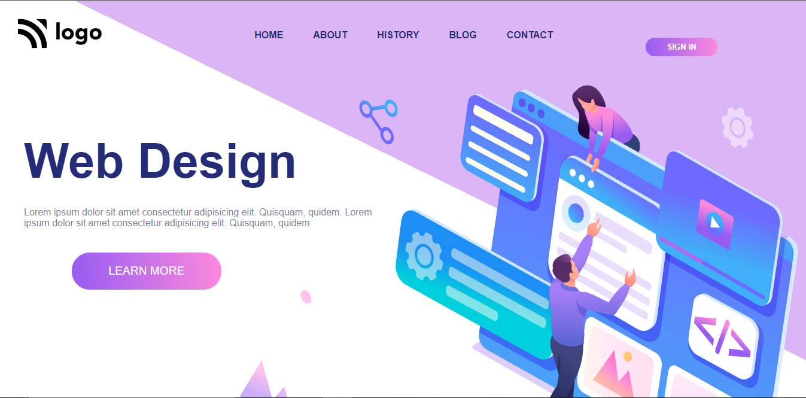

# Web Design Website - HTML5 and CSS (Responsive)

## By Vvarsha

## [Deployed Link](https://varshacreativitysite.netlify.app/) 

## What I learned ? How was my experience while making this project?

- I learned how to use HTML and CSS to create a attractive website.
- I learned about various css properties and tags.
- I learned about how to decorate the button and specific text
- I learned how to target only child of the container
- I learned about z-index to stack images
- I learned about the properties of positions of elements in the HTML and CSS.

## This project took almost 2:40 hours to complete.
